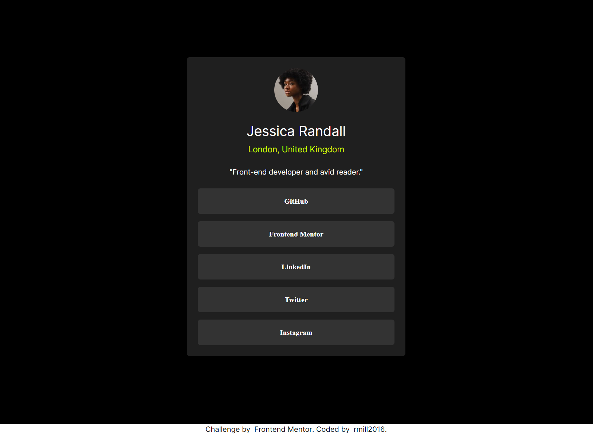

# Frontend Mentor - Social links profile solution

This is a solution to the [Social links profile challenge on Frontend Mentor](https://www.frontendmentor.io/challenges/social-links-profile-UG32l9m6dQ). Frontend Mentor challenges help you improve your coding skills by building realistic projects. 

## Table of contents

- [Overview](#overview)
  - [The challenge](#the-challenge)
  - [Screenshot](#screenshot)
  - [Links](#links)
- [My process](#my-process)
  - [Built with](#built-with)

## Overview

### The challenge

Users should be able to:

- See hover and focus states for all interactive elements on the page

### Screenshot

### Links

- Solution URL: [Add solution URL here](https://github.com/rmill2016/social-links-profile)
- Live Site URL: [Add live site URL here](https://rmill2016-social-links-profile.netlify.app)

## My process

### Built with

- Semantic HTML5 markup
- Aria Labels
- Flexbox
- Grid
- CSS Animations
- Live Server Extension for fast development
- [TailwindCSS](https://tailwindcss.com) - For styles

## Author

- Website - [Ryan's Web Services](https://ryanswebservices.dev)
- Frontend Mentor - [@rmill2016](https://www.frontendmentor.io/profile/rmill2016)

## Aknowledgements

It was a pleasure to complete another challenge in Frontend Mentor. I reimmersed myself with TailwindCSS for fast development through a utility-first class system for styles. I primarily completed this challenge to share with my co-worker who is also learning web development.